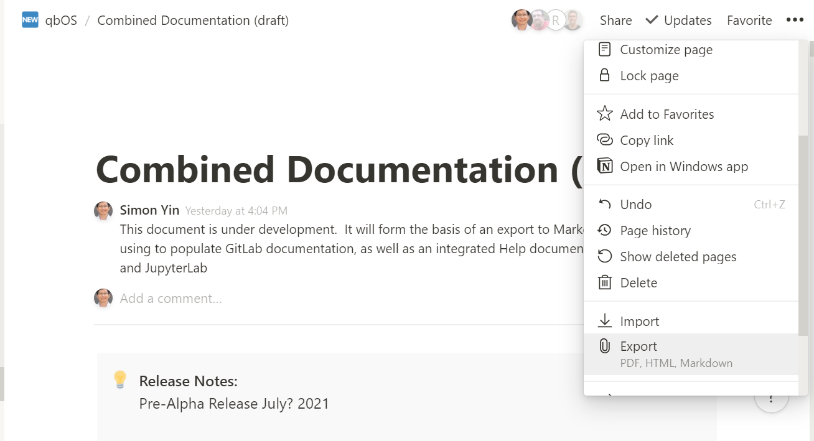

# Markdown export of qbOS Combined Documentation from Notion & import to GitLab

[[_TOC_]]

# 1.0 Background

The aim of this document is to **show the process of exporting a Notion document (see the link above)** and then **importing it into GitLab as a wiki**.  In doing so, the emphasis is on scripted processes to allow eventual automation of this process.

# 2.0 Initial export from Notion in Markdown format (in a .zip file)

On the Notion page that you want to export, navigate to the top-right and click:  **··· → Export**:

When presented with the pop-up shown below, choose:

**Export format**: Markdown & CSV

**Include content**: Everything

**Include subpages**: Yes

Then click: **Export**

You will receive the .zip file either as an immediate download, or else as a link sent to your email address:

## 2.1 Upload .zip archive from the previous step to the GitLab qbos repository location: `qbos/assets/user_guide/src`

