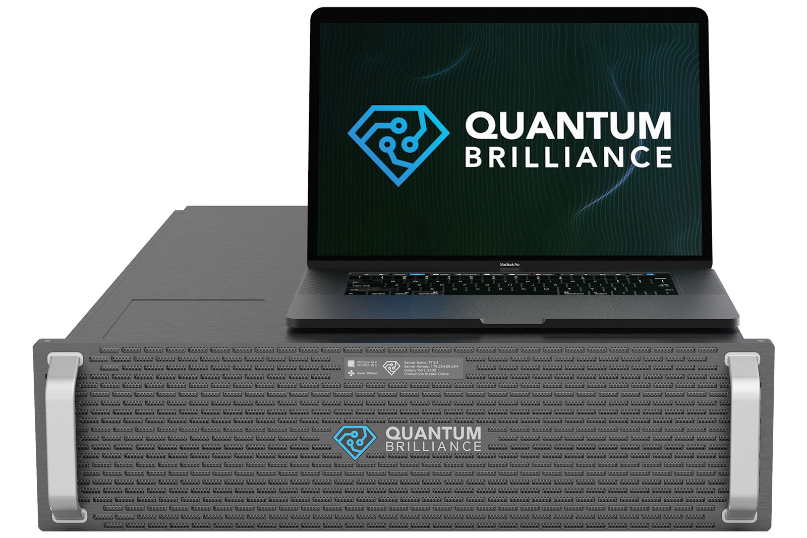

.. qb-core documentation master file, created by
   sphinx-quickstart on Thu Nov 17 06:09:44 2022.
   You can adapt this file completely to your liking, but it should at least
   contain the root `toctree` directive.

Welcome to Qristal -- The Quantum Brilliance SDK
================================================

Qristal is a full-stack library for designing, optimizing, simulating and running hybrid quantum programs.

Features
========

* Execute quantum algorithms directly on `QB's next-generation room temperature quantum accelerators
  <https://quantumbrilliance.com/quantum-brilliance-hardware>`__.

..

* High-level quantum subroutines for **solving practical problems** including **optimization**, **chemistry** and **machine learning**.

..

* A suite of world-class quantum circuit simulators, including GPU-capable and HPC-aware tensor network simulators.

..

* Accurate noise models and emulation of Quantum Brilliance's hardware.

Components and Licensing
========================

This documentation covers both the `Qristal Software Development Kit <https://quantumbrilliance.com/quantum-brilliance-qristal>`_ and its `Emulator plugin <https://quantumbrilliance.com/quantum-brilliance-emulator>`_.

Qristal is released under the open source Apache License, Version 2.0.

The Emulator plugin for Qristal `can be obtained in binary form from Quantum Brilliance <https://quantumbrilliance.com/sales-contact>`_.

.. toctree::
   :caption: Basic Usage

   rst/getting_started
   rst/examples
   rst/backends
   rst/emulator
   rst/vqpu

.. toctree::
   :caption: Advanced Topics

   rst/noise_models
   rst/parametrization
   rst/vqe
   rst/nextflow

.. toctree::
   :caption: Reference

   rst/quantum_gates

.. toctree::
   :maxdepth: 2
   :caption: Source Code Documentation

   _cpp_api/library_root
   rst/python_autodoc

