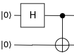

The fastest way to get a working Qristal installation is to [run it directly from the provided Docker image](https://github.com/qbrilliance/qristal#docker).

To learn how to use Qristal, let's run a simple Python example to create a Bell state.

The Bell state is the simplest example of a maximally entangled state, and comprises just 2 qubits. These 2 qubits contribute a Hilbert space of dimension 4. In the qubit basis $\ket{0}$ and $\ket{1}$, these four components are written as
$$ \ket{\Phi^+} = \frac{\ket{00} + \ket{11}}{\sqrt{2}} , $$
$$ \ket{\Phi^-} = \frac{\ket{00} - \ket{11}}{\sqrt{2}} , $$
$$ \ket{\Psi^+} = \frac{\ket{01} + \ket{10}}{\sqrt{2}} , $$
$$ \ket{\Psi^-} = \frac{\ket{01} - \ket{10}}{\sqrt{2}} . $$

A Bell state can be constructed through the application of [simple gates](https://qristal.readthedocs.io/en/latest/rst/quantum_computing.html) such as the Hadamard, X, Z and CNOT gates. Each of the above components are created through their respective circuit:
<center>

*Circuit to create $\ket{\Phi^+}$*:


</center>
<center>

*Circuit to create $\ket{\Phi^-}$*:


</center>
<center>

*Circuit to create $\ket{\Psi^+}$*:


</center>
<center>

*Circuit to create $\ket{\Psi^-}$*:


</center>

Now let's code up the circuit to generate $\ket{\Phi^+}$.

Import the Qristal core:
```python
import qristal.core
```

Create a quantum computing session using Qristal:
```python
my_sim = qristal.core.session()
```

Set the number of shots to run through the circuit:
```python
my_sim.sn = 1024
```

Set the number of qubits:
```python
my_sim.qn = 2
```

Choose the simulator backend:
```python
my_sim.acc = "qpp"
```

Create the $\ket{\Phi^+}$ component of the Bell state using Hadamard and CNOT gates:
```python
my_sim.instring = '''
__qpu__ void MY_QUANTUM_CIRCUIT(qreg q)
{
  OPENQASM 2.0;
  include "qelib1.inc";
  creg c[2];
  h q[0];
  cx q[0], q[1];
  measure q[0] -> c[0];
  measure q[1] -> c[1];
}
'''
```

Run the circuit:
```python
my_sim.run()
```

Print the cumulative results in each of the classical registers:
```python
print(my_sim.results)
```

