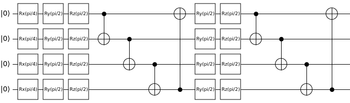
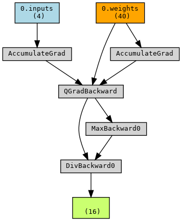

# Quantum Machine Learning (QML)

This page covers the setup and execution of a Hybrid Quantum Machine Learning workflow in Qristal and PyTorch. It covers mainly the Python API.

Quantum machine learning at its core involves a variational quantum circuit, partitioned into two ansatzes. The first is the *encoding* ansatz, which is used to (as the name suggests) encode the input data into the circuit as the parameters of rotation gates. The second is the *variational* ansatz which also contains rotation gates; however, the parameters of these gates are optimized using classical methods to achieve a desired distribution based on the input. 

The data-centric approach, in addition to setting it apart from algorithms of VQE and QAOA, also makes the use of gradients crucial for optimization of the variational parameters while keeping the inputs intact. This reflects the necesssity of backpropagation in classical machine learning algorithms, where one feeds back the gradients through a neural network to calculate the change in output based on the provided input[1]. 

## Defining a variational quantum circuit

To start off, one must define a circuit using the `ParamCirc` class. The default API for this class follows a similar pattern to that of `qb.Circuit()`, and can be initialized by specifying only the number of qubits required. For example, it may be used as shown below to construct a 4-qubit circuit with an encoding ansatz and 2 repetitions of the variational ansatz:

```python
import qb.core.optimization as qbOpt

nQubits = 4
circ = qbOpt.ParamCirc(nQubits)

# encoding ansatz
for i in range(nQubits):
  circ.rx(i, "input")

# variational ansatz, repeated twice
nAnsatzRepetitions = 2
for i in range(nAnsatzRepetitions):
  for qubit in range(nQubits):
    circ.ry(qubit, "variational")
    circ.rz(qubit, "variational")
  for qubit in range(nQubits-1):
    circ.cnot(qubit, qubit+1)
  circ.cnot(nQubits, 0)

circ.measure_all()
```
By running `circ.print()`, we get the following output:

```
Rx(theta_i0) q0
Rx(theta_i1) q1
Rx(theta_i2) q2
Rx(theta_i3) q3
Ry(theta_v0) q0
Rz(theta_v1) q0
Ry(theta_v2) q1
Rz(theta_v3) q1
Ry(theta_v4) q2
Rz(theta_v5) q2
Ry(theta_v6) q3
Rz(theta_v7) q3
CNOT q3,q0
CNOT q0,q1
CNOT q1,q2
CNOT q2,q3
Ry(theta_v8) q0
Rz(theta_v9) q0
Ry(theta_v10) q1
Rz(theta_v11) q1
Ry(theta_v12) q2
Rz(theta_v13) q2
Ry(theta_v14) q3
Rz(theta_v15) q3
CNOT q3,q0
CNOT q0,q1
CNOT q1,q2
CNOT q2,q3
Measure q0
Measure q1
Measure q2
Measure q3
```

This output shows the mapping of the input and variational rotation parameters to the respective gates. Parameters with the prefix `theta_i` are input parameters, while those with the prefix `theta_v` are variational parameters. 

If one chooses to use one of the built-in ansatzes, such as the RDBMS query optimization ansatz, a few more inputs are required.

- Number of qubits
- Ansatz type
- Number of repetitions of the variational ansatz
- Variational gates (one or more of {qb.core.String(["Rx"]),qb.core.String(["Ry"]),qb.core.String(["Rz"])}, passed as qb.core.VectorString)

This will automatically create the structure of the full circuit, including both the encoding and variational ansatzes. For example, in the case of the RDBMS circuit, the encoding ansatz is simply an Rx gate applied across every qubit. The variational ansatz consists of the gates specified in the variational gates argument applied to every qubit, followed by a circular CNOT connection. This variational ansatz is then repeatedly applied based on the number of repetitions specified. At its core, this is the same circuit as the one shown above. However, setting this up is much simpler, and may be done as follows:

```python
from qb.core import String, VectorString
nQubits = 4
nAnsatzRepetitions = 2
varGates = VectorString()
varGates.append(String(["Ry"]))
varGates.append(String(["Rz"]))
circuitType = qbOpt.defaultAnsatzes.qrlRDBMS
circ = qbOpt.ParamCirc(nQubits, circuitType, nAnsatzRepetitions, varGates)
```

To summarize, one should aim to use the the default initializer if more flexibility is required, and the pre-defined ansatz initializer for a simple circuit that is quick to set up. For example, with the former, one may also choose to perform *reuploading* of the input encoding gates wherein they are repeated to ensure the data fidelity is not lost during propagation through the circuit. This is not possible with the latter method (without compromising the integrity of the set circuit), and is set up as follows:

```python
nQubits = 4
circ = qbOpt.ParamCirc(nQubits)

# encoding ansatz
for i in range(nQubits):
  circ.rx(i, "input")

# variational ansatz, repeated twice, with reuploading of encoding ansatz
nAnsatzRepetitions = 2
for i in range(nAnsatzRepetitions):
  if i > 1:
    circ.reupload() # reupload only after the first instance of the variational ansatz
  for qubit in range(nQubits):
    circ.ry(qubit, "variational")
    circ.rz(qubit, "variational")
  for qubit in range(nQubits-1):
    circ.cnot(qubit, qubit+1)
  circ.cnot(nQubits, 0)

circ.measure_all()
```

## Using QMLExecutor to assign values to parameters

We can also use the `QMLExecutor` class to set the parameter values. This class also has functionality to handle the execution and gradient calculations of the paramterized circuit. For example, the following code sets all input parameters to $\frac{\pi}{4}$ and all variational parameters to $\frac{\pi}{2}$:

```python
import math
inputs = circ.numInputs()*[math.pi/4]
params = circ.numParams()*[math.pi/2]
exec = QMLExecutor(circ, inputs, params)
```

The resultant circuit will then look like: 



## Converting the parametrized quantum circuit to a neural network layer

Once the parametrized circuit is set up, it can be connected to PyTorch using the QB QML wrapper. More specifically, one uses the `QuantumLayer` class that subclasses `torch.nn.Module`, allowing it to act identically to a classical neural network layer in PyTorch. The inputs required are:

- The parametrized quantum circuit
- (Optional) the initial inputs. If not set, defaults to `torch.rand(nInputParameters, dtype=torch.float64)`.
- (Optional) the initial weights/variational parameters. If not set, defaults to `torch.rand(nVariationalParameters, dtype=torch.float64)`.
- (Optional) the RNG seed for obtaining consistent results. If not set, defaults to `None`.

The execution and gradient calculations are handled internally, with the gradient being calculated using the parameter-shift rule. All in all, this means only the parametrized circuit and the layer wrapper are required to set up the quantum part of a hybrid neural network. 

```python
import torch
import qb_qml_torch_wrapper as qbML

initWeights = torch.ones(circ.numParams(), dtype=torch.float64)
initInputs = torch.zeros(circ.numInputs(), dtype=torch.float64)
manualSeed = 44
qnn = qbML.QuantumLayer(circ, initial_inputs=initInputs, initial_weights=initWeights, seed=manualSeed)
```

An example of how these can be used to perform optimization of join orders for queries to databases is shown in  `core/examples/python/qml/RDBMS_query_optimization.py`. For a quick initialization of the hybrid NN, one can use the `torch.nn.Sequential` class. We can then put a test tensor through the model, and visualize the resultant hybrid neural network using the `torchviz` package:

```python
import torchviz

normLayer = qbML.NormLayer() # performs the operation x/x.max() on input tensor x
model = torch.nn.Sequential(qnn, normLayer)

testTensor = torch.zeros(circ.numInputs())
testResult = model(testTensor)

torchviz.make_dot(testresult,params=dict(model.named_parameters())).render("qml_nn", format="png")
```

This will give us the following image:



The `QuantumLayer` also handles backpropagation when connected to other classical layers, feeding the gradient through based on the loss. The above image can be interpreted as the graph of the neural network. One can see the output tensor (a 16-dimensional vector, `testResult`) at the bottom, based upon which backpropagation can be carried out. This tensor is the output of the normLayer, which performs the operation $\frac{\vec{x}}{\mathrm{max}(\vec{x})}$ - corresponding to the `MaxBackward` and `DivBackward` nodes. Since both the max and the resultant division operation make use of the output of the previous layer (`QuantumLayer`), they are both connected to `QGradBackward`. This node then feeds the accumulated gradient back, through the `AccumulatedGrad` node(s), to the input `testTensor` (which must be discarded in the quantum case, as the input itself should not be optimized), as well as the weights - which are the variational parameters of the specified quantum circuit, and are correspondingly updated.

Once trained, the model with the updated weights can be saved:

```python
torch.save(model.state_dict(), PATH)
```

To load the model and perform inference (or continue training), set up the model as shown previously and load the state dict to provide the trained weights:

```python
model.load_state_dict(torch.load(PATH))
```

Using the above workflow, it is possible to create a hybrid quantum-classical machine learning workflow from any existing machine learning algorithm compatible with PyTorch. The C++ and Python APIs of `ParamCirc` and `QMLExecutor` may also be used to construct custom ML integrations with other packages.

## References

[1] R. Rojas, Neural Networks: A Systematic Introduction (Springer, Berlin, 1996) pp. 161-172. 